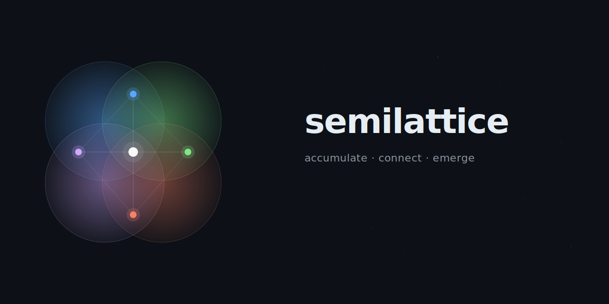

<p align="center">
  
</p>

<p align="center">
  <strong>A semantic relationship layer on top of your file tree.</strong><br>
  Replace intelligence with data. Let cheap models find every relevant file.
</p>

---

## The Problem

File systems are trees. Trees force every file into exactly one location and express only parent-child relationships.

But real codebases don't think in trees. `auth_middleware.rs` belongs to "authentication" *and* "middleware" *and* "security" — simultaneously. A tree can't represent that.

**This is painful for AI agents.** Every time an AI agent explores a codebase, it reconstructs the relationship structure from scratch:

1. Run `tree` to see the directory layout
2. Guess which files to open
3. Chase `import` / `use` statements
4. Repeat until the picture is complete

This exploration requires **judgment**. A capable model knows to keep digging. A cheap model stops at the first match and misses files. The result: bugs from incomplete understanding, wasted tokens on re-exploration, and quality that depends entirely on model intelligence.

## The Insight

**What if we replaced intelligence with data?**

|  | Without sl | With sl |
|---|---|---|
| Required model capability | High (exploration judgment) | Low (just look up the data) |
| Risk of missing files | Depends on model quality | Depends on accumulated data |
| Token consumption | Massive (exploration) | One query |
| First task on a topic | Exploration needed (same) | Exploration needed (same) |
| Second task onward | Explore again | Instant retrieval from data |

Semilattice (`sl`) records which files were involved in each task. As work accumulates, a semantic graph emerges — and queries against that graph surface related files instantly, without exploration.

**The key shift: from model intelligence to accumulated data.**

## How It Works

Semilattice builds a graph where **contexts** (labeled groups of files from past work) overlap through shared files. This creates a [semilattice](https://en.wikipedia.org/wiki/Semilattice) — a structure where overlapping sets produce emergent relationships that no one explicitly defined.

```
Task 1 "tax calculation bugfix":    cart.rs, payment.rs, invoice_pdf.rs
Task 2 "invoice compliance":        invoice_pdf.rs, invoice_template.rs, tax_config.rs
Task 3 "cart UI redesign":          cart.rs, cart_ui.tsx, pricing.rs

→ sl query "sales tax display"
  No context with this exact label exists. But:
  - "tax calculation" and "cart" intersect at cart.rs
  - "tax calculation" and "invoice" intersect at invoice_pdf.rs
  → cart.rs, invoice_pdf.rs, tax_config.rs, cart_ui.tsx emerge
```

**Accumulation creates emergent structure.**

Query works in two phases:
1. **Semantic entry** — embed the query with [multilingual-e5-small](https://huggingface.co/intfloat/multilingual-e5-small), find the most relevant contexts by cosine similarity
2. **Graph traversal** — BFS through shared files to neighboring contexts, with score decay per hop

> Inspired by Christopher Alexander's *["A City is Not a Tree"](https://www.patternlanguage.com/archive/cityisnotatree.html)* (1965) — the insight that natural structures are semilattices, not trees.

## Demo

```bash
# Record relationships from past work
$ sl add "vector search embedding" src/embedding.rs src/store.rs Cargo.toml
[vector search embedding] 3 files recorded

# Query — even cross-language works (multilingual model)
$ sl query "semantic search graph traversal"
"semantic search graph traversal" → 7 files (via 4 contexts)

  Cargo.toml (score: 0.81)
    via [vector search embedding] (direct, 0.81)
    via [CLI foundation init/add/query] (1hop, 0.38)
  src/embedding.rs (score: 0.81)
    via [vector search embedding] (direct, 0.81)
  src/store.rs (score: 0.81)
    via [vector search embedding] (direct, 0.81)
    via [graph traversal BFS hop-based decay] (direct, 0.78)
  src/main.rs (score: 0.78)
    via [graph traversal BFS hop-based decay] (direct, 0.78)
  src/db.rs (score: 0.38)
    via [CLI foundation init/add/query] (1hop, 0.38)
```

Each result shows **why** it was found — which context, how many hops, what score.

## Installation

```bash
git clone https://github.com/yataro-fujinaga/semilattice.git
cd semilattice
cargo install --path .
```

The embedding model (~100MB) is downloaded automatically on first `sl query`.

### Requirements
- Rust 2024 edition (1.85+)
- No external services, no API keys — everything runs locally

## Usage

```bash
# Initialize in any project
sl init

# Record a relationship
sl add "login bugfix" src/auth.rs src/handlers.rs tests/auth_test.rs

# Semantic search (vector similarity + graph traversal)
sl query "authentication"

# Text-only search (no embedding, fast)
sl query "auth" --text-only

# Tune the search
sl query "auth" --top-k 5 --max-hops 3 --decay 0.6

# List all recorded contexts
sl contexts

# Show files in a specific context
sl show "login"
```

### Integration with AI Agents

Add this to your project's agent instructions (e.g., `CLAUDE.md`):

```markdown
## Before starting work
Run `sl query "task description"` to find related files.

## After completing work
Run `sl add "what you did" file1 file2 ...` to record the relationship.
```

The more an agent works, the richer the graph becomes.

## Architecture

```
┌─────────────────────────────────────────────┐
│         Application / AI Agent              │
│  "all files related to login" → one query   │
└──────────────────┬──────────────────────────┘
                   │ semantic query
┌──────────────────▼──────────────────────────┐
│            .sl/ (relationship layer)        │
│  - Context × file groups (SQLite)           │
│  - Vector search (multilingual-e5-small)    │
│  - Graph traversal (BFS + hop decay)        │
└──────────────────┬──────────────────────────┘
                   │ path-based read/write
┌──────────────────▼──────────────────────────┐
│         File tree (unchanged)               │
│  ls, find, git — everything still works     │
└─────────────────────────────────────────────┘
```

Analogous to how [Jujutsu](https://github.com/jj-vcs/jj) reimagines version control on top of Git: Semilattice adds a semantic layer on top of the file tree without replacing it.

## Tech Stack

- **Language**: Rust
- **Embedding**: [intfloat/multilingual-e5-small](https://huggingface.co/intfloat/multilingual-e5-small) via [candle](https://github.com/huggingface/candle) (pure Rust, no Python, no ONNX)
- **Storage**: SQLite (`.sl/relations.db`)
- **Search**: Cosine similarity for entry points → BFS graph traversal with hop-based score decay

## Status

Early stage. Core functionality works — `init`, `add`, `query`, `contexts`, `show`.

Open questions:
- Relationship freshness — should old relations decay over time?
- File-level vs function-level granularity
- Sharing `.sl/` across team members
- Cold start strategies

## License

MIT
